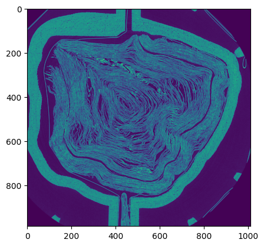

# vesuvius
From [Vesuvius Challenge](https://scrollprize.org), a Python library for accessing CT scans of ancient scrolls.

`vesuvius` allows direct access to scroll data **without** managing download scripts or storing terabytes of CT scans locally:

```python
import vesuvius
import matplotlib.pyplot as plt

scroll = vesuvius.Volume("Scroll1")
img = scroll[1000,:,:]

plt.imshow(img)
```



Data is streamed in the background, only serving the requested regions.

The library provides tools for accessing, managing, and manipulating high-resolution volumetric data related to Vesuvius Challenge. It supports both remote and local data, with options for caching and normalization.

For a similar library in C, see [vesuvius-c](https://github.com/ScrollPrize/vesuvius-c).

> ⚠️ `vesuvius` is in beta and the interface may change. Not all Vesuvius Challenge data is currently available - data will continue to be added to the library.

## 📓 Introductory notebooks
To get started, we recommend these notebooks that jump right in:

1. 📊 [Scroll Data Access](https://colab.research.google.com/github/ScrollPrize/vesuvius/blob/main/notebooks/example1_data_access.ipynb): an introduction to accessing scroll data using a few lines of Python!

2. ✒️ [Ink Detection](https://colab.research.google.com/github/ScrollPrize/vesuvius/blob/main/notebooks/example2_ink_detection.ipynb): load and visualize segments with ink labels, and train models to detect ink in CT.

3. 🧩 [Volumetric instance segmentation cubes](https://colab.research.google.com/github/ScrollPrize/vesuvius/blob/main/notebooks/example3_cubes_bootstrap.ipynb): how to access instance-annotated cubes with the `Cube` class, used for volumetric segmentation approaches.

## `vesuvius` does:
- **Data retrieval**: Fetches volumetric scroll data, surface volumes of scroll segments, and annotated volumetric instance segmentation labels. Remote repositories and local files are supported.
- **Data listing**: Lists the available data on [our data server](https://dl.ash2txt.org).
- **Data caching**: Caches fetched data to improve performance when accessing remote repositories.
- **Normalization**: Provides options to normalize data values.
- **Multiresolution**: Accesses and manages data at multiple image resolutions.

## `vesuvius` doesn't do:
- **Remote data modification**: The read-only library does not support modifying the original data.
- **Complex analysis**: While it provides access to data, it does not include built-in tools for complex data analysis or visualization.

## Installation

`vesuvius` can be installed with `pip`.
Then, before using the library for the first time, accept the license terms:
```sh
$ pip install vesuvius
$ vesuvius.accept_terms --yes
```

## Usage

The library can be imported in Python:
```python
import vesuvius
```

### Listing

#### Listing files
To list the available files in the remote repository, use the following code:

```python
from vesuvius import list_files

files = list_files()
```

The output of `list_files` is a dictionary that contains the paths to all the scroll volumes and segment surface volumes available in the data repository. The dictionary structure is as follows:

- The top-level keys are `scroll_id`.
- Under each `scroll_id`, there are keys for different `energy` levels.
- Under each `energy`, there are keys for different `resolution` levels.
- Under each `resolution`, there are keys for either `segments` or `volume`.

`segments` can contain `segment_id`s.

Here is a visual representation of what the dictionary can look like:

```plaintext
{
  'scroll_id1': {
    'energy1': {
      'resolution1': {
        'segments': {
          'segment_id1': 'path/to/segment_id1',
          'segment_id2': 'path/to/segment_id2'
        },
        'volume': 'path/to/volumes'
      },
      'resolution2': {
        'segments': {
          'segment_id1': 'path/to/segment_id1',
          'segment_id2': 'path/to/segment_id2'
        },
        'volume': 'path/to/volumes'
      }
    },
    'energy2': {
      'resolution1': {
        'segments': {
          'segment_id1': 'path/to/segment_id1',
          'segment_id2': 'path/to/segment_id2'
        },
        'volume': 'path/to/volume'
      },
    }
  },
  'scroll_id2': {
    'energy1': {
      'resolution1': {
        'segments': {
          'segment_id1': 'path/to/segment_id1',
          'segment_id2': 'path/to/segment_id2'
        },
        'volume': 'path/to/volumes'
      },
    }
  }
}
```

This structure allows you to access specific paths based on the `scroll_id`, `energy`, `resolution`, and `segment_id` of the data you are interested in. This function is automatically executed when the library is imported to constantly keep the list of available files updated.

#### Listing cubes
To list the available instance annotated volumetric cubes:
```python
from vesuvius import cubes

available_cubes = cubes()
```

Similarly to `list_files` the output of `cubes` is a dictionary:
```plaintext
{
  'scroll_id1': {
    'energy1': {
      'resolution1': {
        'z1_y1_x1': 'path/to/z1_y1_x1',
        'z2_y2_x2': 'path/to/z2_y2_x2'
        }
      }
    }
}
```
`z_y_x` are the coordinates in the relative scroll volume of the origin of the reference frame of the selected cube.

### Importing and using `Volume`
The `Volume` class is used for accessing volumetric data, both for scrolls and surface volume of segments.

#### Example usage
```python
from vesuvius import Volume
# Basic usage
scroll = Volume(type="Scroll1") # this is going to access directly the canonical scroll 1 volume

# Basic usage specifying scan metadata
scroll = Volume(type="scroll", scroll_id=1, energy=54, resolution=7.91) # if you want to access a non canonical volume, you have to specify the scan metadata

# With cache (works only with remote repository)
scroll = Volume(type="scroll", scroll_id=1, energy=54, resolution=7.91, cache=True)

# Deactivate/activate caching (works only with remote repository)
scroll.activate_caching() # Don't need to do this if loaded the volume with cache=True
scroll.deactivate_caching()

# With normalization
scroll = Volume(type="scroll", scroll_id=1, energy=54, resolution=7.91, normalize=True)

# Visualize which subvolumes are available
scroll.meta()

# To print meta at initialization, use the argument verbose=True
scroll = Volume(type="Scroll1", verbose=True)

# To access shapes of multiresolution arrays
subvolume_index = 3  # third subvolume
shape = scroll.shape(subvolume_index)

# To access dtype
dtype = scroll.dtype

# Access data using indexing
data = scroll[:, :, :, subvolume_index]  # Access the entire third subvolume

# When only three or less indices are specified, you are automatically accessing to the main subvolume (subvolume_index = 0)

data = scroll[15] # equal to scroll[15,:,:,0]
data = scroll[15,12] # equal to scroll [15,12,:,0]

# Slicing is also permitted for the first three indices
data = scroll[20:300,12:18,20:40,2]

```
#### With local files
If you fully downloaded a scroll volume, or a segment, you can directly specify its local path on your device:
```python
scroll = Volume(type="scroll", scroll_id=1, energy=54, resolution=7.91, domain="local", path="/path/to/54keV_7.91um.zarr")
```

#### Segments
You can access segments in a similar fashion:
```python
from vesuvius import Volume
# Basic usage
segment = Volume("20230827161847") # access a segment specifying is unique timestamp

# Basic usage specifying scan metadata
segment = Volume(type="segment", scroll_id=1, energy=54, resolution=7.91, segment_id=20230827161847)

```
#### Constructor
```python
Volume(
    type: Union[str, int],
    scroll_id: Optional[int] = None,
    energy: Optional[int] = None,
    resolution: Optional[float] = None,
    segment_id: Optional[int] = None,
    cache: bool = True,
    cache_pool: int = 1e10,
    normalize: bool = False,
    verbose: bool = True,
    domain: str = "dl.ash2txt",
    path: Optional[str] = None
)
```
- **type**: Type of volume, either 'scroll', 'scroll#' or 'segment'.
- **scroll_id**: Identifier for the scroll.
- **energy**: Energy level.
- **resolution**: Resolution level.
- **segment_id**: Identifier for the segment.
- **cache**: Enable caching.
- **cache_pool**: Cache pool size in bytes.
- **normalize**: Normalize the data.
- **verbose**: Enable verbose output.
- **domain**: Domain, either 'dl.ash2txt' or 'local'.
- **path**: Path to the local data.

#### Methods
- **activate_caching()**: Activates caching.
- **deactivate_caching()**: Deactivates caching.
- **shape(subvolume_idx: int = 0)**: Returns the shape of the specified subvolume.

### Importing and using `Cube`
The `Cube` class is used for accessing segmented cube data.

#### Example usage
```python
from vesuvius import Cube

# Basic usage
cube = Cube(scroll_id=1, energy=54, resolution=7.91, z=2256, y=2512, x=4816, cache=True, cache_dir='/path/to/cache')  # with caching

# if caching=True but cache_dir is not selected, the instances will be automatically saved in $HOME / vesuvius / annotated-instances

cube = Cube(scroll_id=1, energy=54, resolution=7.91, z=2256, y=2512, x=4816, cache=False)  # without caching

# With normalization
cube = Cube(scroll_id=1, energy=54, resolution=7.91, z=2256, y=2512, x=4816, normalize=True)

# Deactivate/activate caching
cube.activate_caching(cache_dir=None)  # or define your own cache_dir
cube.deactivate_caching()

# To access the volume and the masks
volume, mask = cube[:, :, :]  # also works with slicing
```

#### Constructor
```python
Cube(
    scroll_id: int,
    energy: int,
    resolution: float,
    z: int,
    y: int,
    x: int,
    cache: bool = True,
    cache_dir: Optional[os.PathLike] = None,
    normalize: bool = False
)
```
- **scroll_id**: Identifier for the scroll.
- **energy**: Energy level.
- **resolution**: Resolution level.
- **z**: Z-coordinate.
- **y**: Y-coordinate.
- **x**: X-coordinate.
- **cache**: Enable caching.
- **cache_dir**: Directory for cache.
- **normalize**: Normalize the data.

#### Methods
- **load_data()**: Loads data.
- **activate_caching()**: Activates caching.
- **deactivate_caching()**: Deactivates caching.

## Additional notes
- **Terms acceptance**: Ensure that the terms are accepted before using the library.
- **Caching**: Caching is only supported with the remote repository.
- **Normalization**: The `normalize` parameter normalizes the data to the maximum value of the dtype.
- **Local files**: For local files, provide the appropriate path in the `Volume` constructor.

